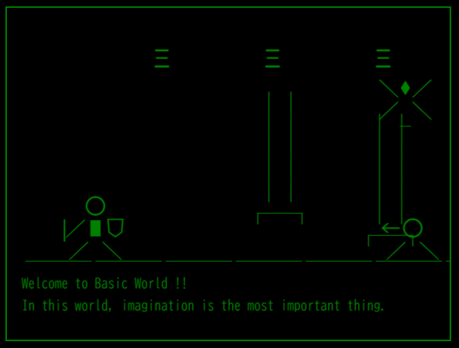

Knight
========

Programming Retro Game in Rust & WebAssembly

[](https://myurioka.github.io/Knight/)

[Play in browser](https://myurioka.github.io/Knight)

### How to play (Control)

Defeat your enemies and reach the goal.

  * INPUT 's' Key in Text Field & Enter: Start Game
  * INPUT 'r' Key in Text Field & Enter: Go Right
  * INPUT 'l' Key in Text Field & Enter: Go Left
  * INPUT 'a' Key in Text Field & Enter: Attack
  * INPUT 'j' Key in Text Field & Enter: Jump

### Requirement

  * Rust, Cargo
  * WASM

### How to Build & Run

  ```sh
  $ cd Kngiht
  $ pnpm build-wasm
  $ pnpm dev --open
  ```